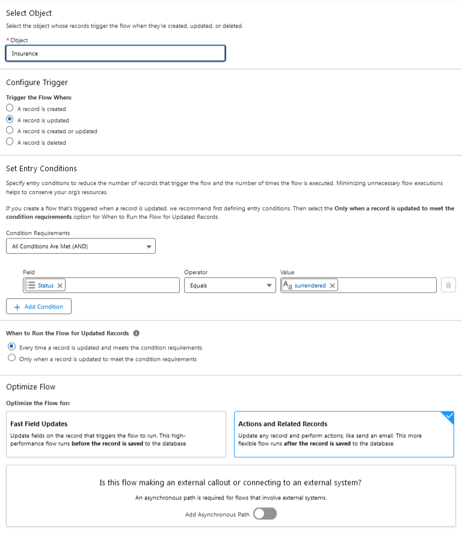
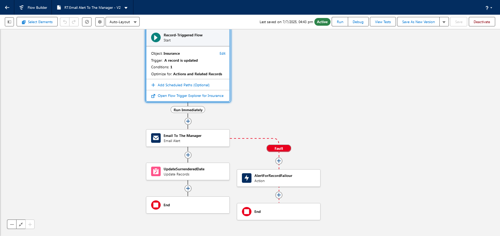
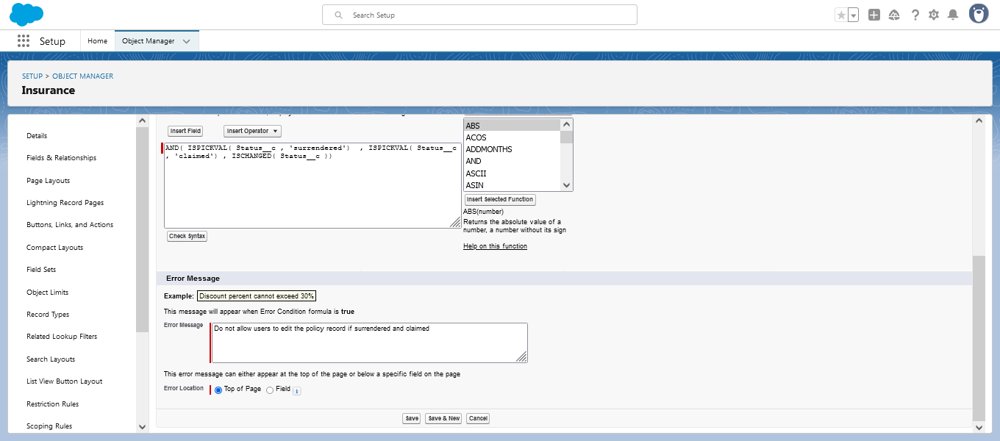
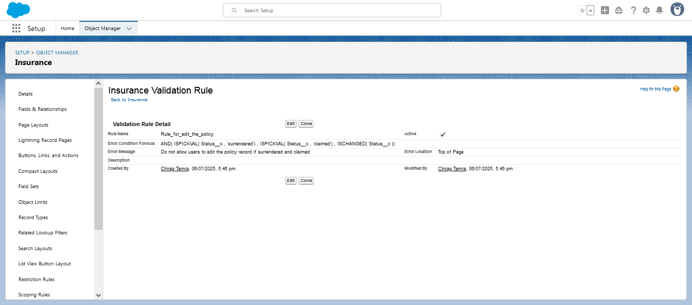

# Salesforce-Insurance-Mangement
Developerd a salesforce-based insurance mangement system to handle customer and insurance details efficiently.
# Salesforce Insurance Management System

A Salesforce-based project to manage customer insurance policies, automate workflows, enforce business rules, and generate insightful reports.

## 🚀 Features

- **Custom Object: Insurance**
  - Fields: Insurance Type, Sub-Type, Start Date, Maturity Date, Yearly Premium, Insurance Value, Date of Surrender.
  - Formula Field to calculate Total Paid.
  - Dependent picklists for Type and Sub-Type.

- **Flow Automation**
  - Updates the surrender date automatically when status is changed.
  - Sends an email to the Insurance Manager on surrender.

- **Validation Rules**
  - Prevents editing of records once status is "Surrendered".
  - Restricts changes to important fields like Insurance Type after surrender.

- **Reports & Dashboards**
  - Funnel chart to show Insurance Value distributed by customers.

- **Permission Control**
  - Profiles and Permission Sets configured to restrict record editing based on surrender status.

- **UI Enhancements**
  - Custom tabs and page layout with roll-up view of total insurance records under contacts.

## 📸 Screenshots

- 
-  Fields](fiels and object Insurance(1).png)
- 
-  
- 
-  
- 

## 🧰 Tools & Technologies

- Salesforce CRM (Lightning Experience)
- Flow Builder
- Validation Rules
- Classic Email Templates
- Reports & Dashboards
- Permission Sets and Profiles

